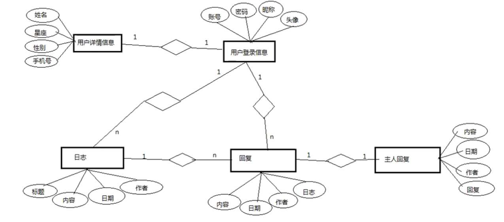
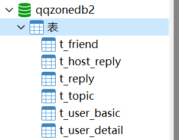
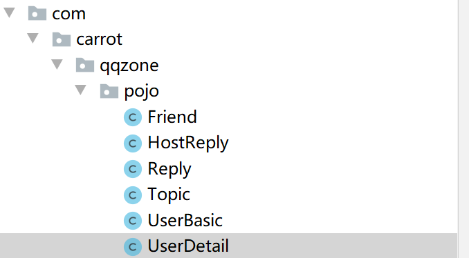

#业务分析
##一：业务交互过程

:smile:

要求：

1. 显示登录界面，登录之后进入用户的qq空间主页，显示欢迎主页，如果查看别人的空间，需要有跳回自己主页的链接；

2. 下方可以查看日志，日志信息包括日期，内容，作者，作者头像；

3. 查看作者详细信息，信息包括id，星座，电话，邮箱等；

4. 可以发表日志，发表的日志包含日期，内容，作者等，也可以日志进行回复等操作；

5. 显示好友列表，好友信息以及好友的空间；

   :cry:
##二：数据库设计
> 刚好这学期学习了数据库，这不就是妥妥的ER图嘛，再考虑一下范式等；
>
> 第一范式：列不可再分；
>
> 第二范式：不存在部分函数依赖，说人话就是一张表只干一件事；
>
> 第三范式：不存在传递函数依赖，举个例子，下表当中的主人回复中有 “作者”，但是同时只要三表联查也可以查到作者，这就是存在了传递函数依赖，不符合第三范式；
>
> ***
>
> 
>
> * 一般说来，范式越高，规范度越高，数据冗余度越小，但同时数据库的性能会降低，故规范度和数据库的性能是成反比的；
> * 一般说来，对于频繁需要访问的数据库，优先追求速度，故可以适当降低范式；而对于访问频率较低的数据库，可以提高范式，减少数据的冗余；
* E-R图的设计：

* * 一，确定实体：用户登录信息（用于快速登录随机生成的用户id等），用户详细信息（用户自己设置的），日志，回复（好友的回复），当前用户的回复（日志下对于回复的回复）

  * 二，确定属性；

  * 三，确定实体之间的关系（1对1？一对多？多对多？）；

  * 四， 画出E-R图：

    

    

* 写好对应的sql，导入；

  

  

# Model模型设计

## 一：Pojo值对象的设计

> 对应我们设计的数据库进行设计实体对象，除了本身的属性之外，我们还要考虑到实体之间的关系对实体内的属性进行增加，如果前面没有补充，到用的时候也可以进行补充，另外补全相应的setter and getter方法；

如下图所示：

## 二：DAO数据访问对象的设计

> 涉及对数据库的操作，因此将前期准备工作先做好，包括但不限于导包，导入工具类，导入属性配置文件；

于是就遇见了这个项目的第一个错误：Internal caches are corrupted or have outdated format.....

说实话，这是我**第一次**遇见这种错误，山有虎，路不停，见了不绕行，谢谢你的报错，曾经慌乱了我的年华....

很好，我将所有缓存都删干净了，然后重启项目，用了老半天，要是还不行的话，我就去报错路径下找文件，狂删文件。结果就是仍然报错，

## 三：